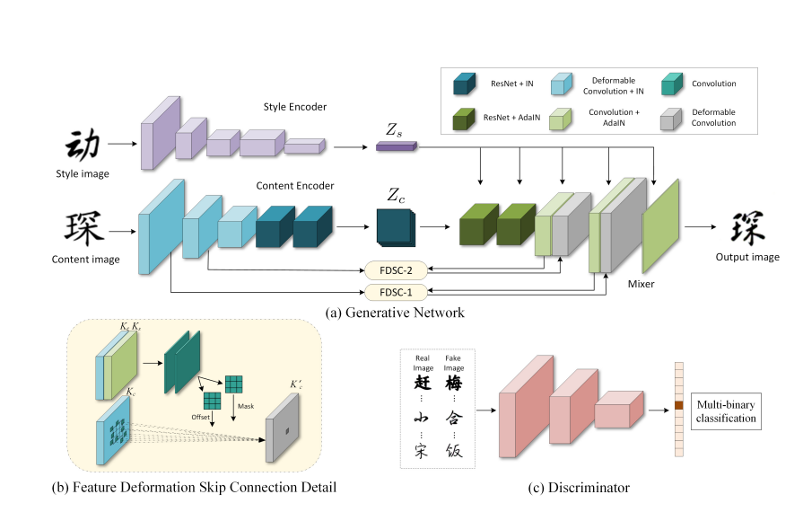
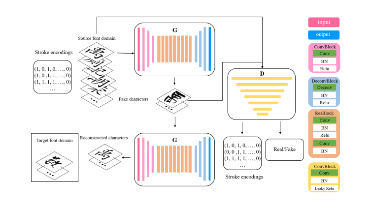
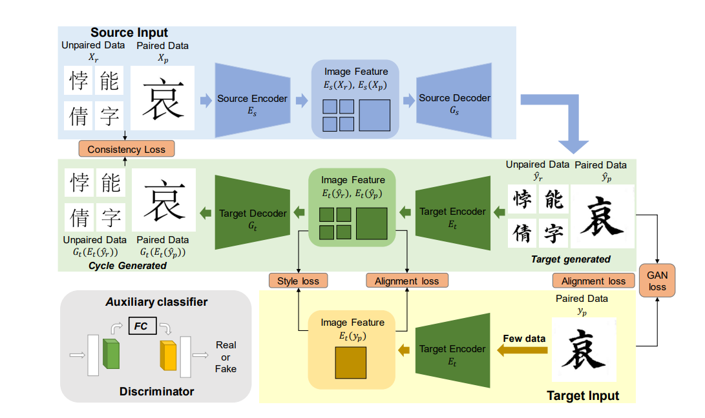
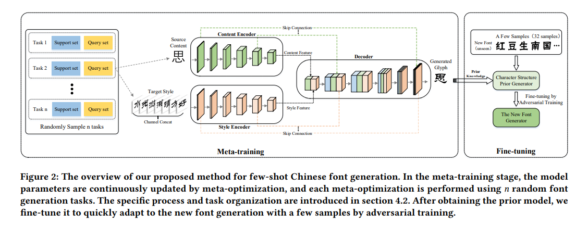
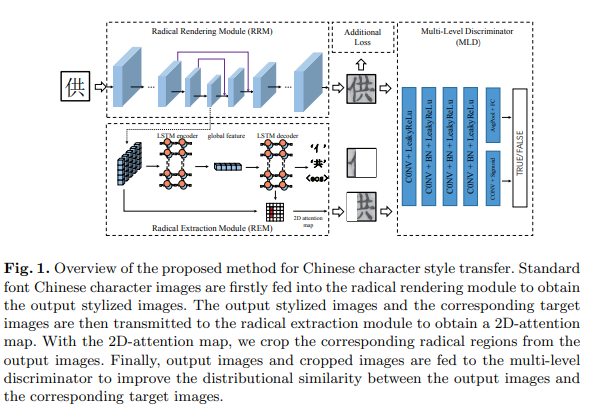

## Font Generation GAN

Collection of PyTorch or tensorflow implementations of Font Generation based on Generative Adversarial Network varieties presented in research papers. 

## blog

  * [Implementations](#implementations)
    + https://yuanyi.pub/
    + https://shuangli.xyz/
    + https://mhy12345.xyz/papers/separating-style-and-content-for-generalized-style-transfer/
    + 

## Table of Contents
  * [Implementations](#implementations)
    + [DG-Font](#DG-Font)     CVPR2021

    + [StrokeGAN](#StrokeGAN)      AAAI  2021

    + [ZiGAN](#ZiGAN)     ACM Multimedia 2021

    + [MLFont](#MLFont)    ICMR 2021

    + [RD-GAN](#RD-GAN)    ECCV 2020

      

## Implementations   
### DG-Font
DG-Font: Deformable Generative Networks for Unsupervised Font Generation

#### Authors
Yangchen Xie Xinyuan Chen* Li Sun Yue Lu

Shanghai Key Laboratory of Multidimensional Information Processing, East China Normal University, 200241 Shanghai, China

#### Abstract
Font generation is a challenging problem especially for some writing systems that consist of a large number of characters and has attracted a lot of attention in recent years. However, existing methods for font generation are often in supervised learning. They require a large number of paired data, which is labor-intensive and expensive to collect. Besides, common image-to-image translation models often define style as the set of textures and colors, which cannot be directly applied to font generation. To address these problems, we propose novel deformable generative networks for unsupervised font generation (DGFont). We introduce a feature deformation skip connection (FDSC) which predicts pairs of displacement maps and employs the predicted maps to apply deformable convolution to the low-level feature maps from the content encoder. The outputs of FDSC are fed into a mixer to generate the final results. Taking advantage of FDSC, the mixer outputs a high-quality character with a complete structure. To further improve the quality of generated images, we use three deformable convolution layers in the content encoder to learn style-invariant feature representations. Experiments demonstrate that our model generates characters in higher quality than state-of-art methods. 

[[Paper]](https://arxiv.org/abs/2104.03064) [[Code]](https://github.com/ecnuycxie/DG-Font)

### StrokeGAN
StrokeGAN: Reducing Mode Collapse in Chinese Font Generation via Stroke Encoding

#### Authors
Jinshan Zeng1 , Qi Chen1 , Yunxin Liu1 , Mingwen Wang1∗ , Yuan Yao

 School of Computer and Information Engineering and Institute of Artificial Intelligence, Jiangxi Normal University, Nanchang, China

#### Abstract
The generation of stylish Chinese fonts is an important problem involved in many applications. Most of existing generation methods are based on the deep generative models, particularly, the generative adversarial networks (GAN) based models. However, these deep generative models may suffer from the mode collapse issue, which significantly degrades the diversity and quality of generated results. In this paper, we introduce a one-bit stroke encoding to capture the key mode information of Chinese characters and then incorporate it into CycleGAN, a popular deep generative model for Chinese font generation. As a result we propose an efficient method called StrokeGAN, mainly motivated by the observation that the stroke encoding contains amount of mode information of Chinese characters. In order to reconstruct the one-bit stroke encoding of the associated generated characters, we introduce a stroke-encoding reconstruction loss imposed on the discriminator. Equipped with such one-bit stroke encoding and stroke-encoding reconstruction loss, the mode collapse issue of CycleGAN can be significantly alleviated, with an improved preservation of strokes and diversity of generated characters. The effectiveness of StrokeGAN is demonstrated by a series of generation tasks over nine datasets with different fonts. The numerical results demonstrate that StrokeGAN generally outperforms the state-of-the-art methods in terms of content and recognition accuracies, as well as certain stroke error, and also generates more realistic characters

[[Paper]](https://www.aaai.org/AAAI21Papers/AAAI-6293.ZengJ.pdf) [[Code]](https://github.com/JinshanZeng/StrokeGAN)

### ZiGAN
ZiGAN:Fine-grained Chinese Calligraphy Font Generation via a Few-shot Style Transfer Approach

#### Authors
Qi Wen, Shuang Li, Bingfeng Han, Yi Yuan

#### Abstract
Chinese character style transfer is a very challenging problem because of the complexity of the glyph shapes or underlying structures and large numbers of existed characters, when comparing with English letters. Moreover, the handwriting of calligraphy masters has a more irregular stroke and is difficult to obtain in real-world scenarios. Recently, several GAN-based methods have been proposed for font synthesis, but some of them require numerous reference data and the other part of them have cumbersome preprocessing steps to divide the character into different parts to be learned and transferred separately. In this paper, we propose a simple but powerful end-to-end Chinese calligraphy font generation framework ZiGAN, which does not require any manual operation or redundant preprocessing to generate fine-grained target style characters with few-shot references. To be specific, a few paired samples from different character styles are leveraged to attain fine-grained correlation between structures underlying different glyphs. To capture valuable style knowledge in target and strengthen the coarse-grained understanding of character content, we utilize multiple unpaired samples to align the feature distributions belonging to different character styles. By doing so, only a few target Chinese calligraphy characters are needed to generated expected style transferred characters. Experiments demonstrate that our method has a state-of-the-art generalization ability in few-shot Chinese character style transfer

[[Paper]](https://arxiv.org/pdf/2108.03596.pdf) 

# MLFont

# MLFont: Few-Shot Chinese Font Generation via Deep Meta-Learning

#### Authors
*Chen, Xu and Wu, Lei and He, Minggang and Meng, Lei and Meng, Xiangxu*

#### Abstract
The automatic generation of Chinese fonts is challenging due to the large quantity and complex structure of Chinese characters. When there are insufficient reference samples for the target font, existing deep learning-based methods cannot avoid overfitting caused by too few samples, resulting in blurred glyphs and incomplete strokes. To address these problems, this paper proposes a novel deep meta-learning-based font generation method (MLFont) for few-shot Chinese font generation, which leverages existing fonts to improve the generalization capability of the model for new fonts. Existing deep meta-learning methods mainly focus on few-shot image classification. To apply meta-learning to font generation, we present a meta-training strategy based on Model-Agnostic Meta-Learning (MAML) and a task organization method for font generation. The meta-training makes the font generator easy to fine-tune for new font generation tasks. Through random font generation tasks and extraction of glyph content and style separately, the font generator learns the prior knowledge of character structure in the meta-training stage, and then quickly adapts to the generation of new fonts with a few samples by fine-tuning of adversarial training. Extensive experiments demonstrate that our method outperforms the state-of-the-art methods with more complete strokes and less noise in the generated character images.

[[Paper]](./assets/3460426.3463606.pdf) 

### RD-GAN
RD-GAN: Few/Zero-Shot Chinese Character Style Transfer via Radical Decomposition and Rendering

#### Authors
Yaoxiong Huang1,2 , Mengchao He2 , Lianwen Jin ?1 , and Yongpan Wang2

#### Abstract
Style transfer has attracted much interest owing to its various applications. Compared with English character or general artistic style transfer, Chinese character style transfer remains a challenge owing to the large size of the vocabulary(70224 characters in GB18010- 2005) and the complexity of the structure. Recently some GAN-based methods were proposed for style transfer; however, they treated Chinese characters as a whole, ignoring the structures and radicals that compose characters. In this paper, a novel radical decomposition-andrendering-based GAN(RD-GAN) is proposed to utilize the radical-level compositions of Chinese characters and achieves few-shot/zero-shot Chinese character style transfer. The RD-GAN consists of three components: a radical extraction module (REM), radical rendering module (RRM), and multi-level discriminator (MLD). Experiments demonstrate that our method has a powerful few-shot/zero-shot generalization ability by using the radical-level compositions of Chinese characters.

[[Paper]](https://www.ecva.net/papers/eccv_2020/papers_ECCV/papers/123510154.pdf) 

#### 

    

